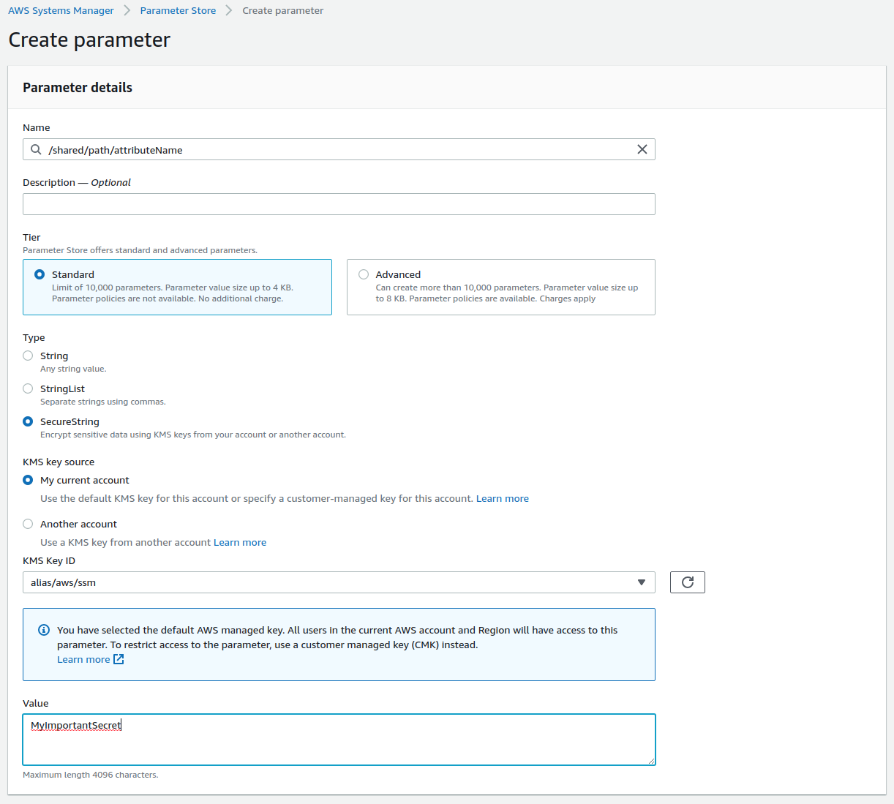

# DIU.MagicWand
### Tools that make the Flow/Neos development easier

This package is intended to be used on development systems and should **NEVER** be
installed on production servers. **Please add this package to the require-dev
section of your composer.json**.

### Original Authors & Sponsors (Sitegeist.MagicWand)

* Wilhelm Behncke - behncke@sitegeist.de
* Martin Ficzel - ficzel@sitegeist.de
* ... and others

*The original development and the public-releases of this package is generously sponsored by https://www.sitegeist.de.*

### This package has been modified by DIU for using Amazon AWS Lambda functions to import SQL dumps

* christian.schwahn@di-unternehmer.com

*The development and the public-releases of this package is generously sponsored by https://www.di-unternehmer.com.*

## Easy and fast cloning of Flow and Neos Installations

The CLI commands `clone:list`, `clone:preset` to help to
clone a remote Flow/Neos setup into the local Flow/Neos installation that executes the command.

**Attention: These commands will empty the local database and resources of your local Flow installation.
The data is replaced with the information from the remote host. Make sure you understand that before actually
using the commands.**

### CLI-Examples
```
# show all available presets
./flow clone:list

# clone from remote host with the information stored in the master preset
./flow clone:preset master
```

### Settings.yaml

The presets that are defined in the configuration path. `DIU.MagicWand.clonePresets`

```yaml
DIU:
  MagicWand:
    flowCommand: './flow'

    # preset which is used by the clone:default command
    defaultPreset: 'master'

    # available presets
    clonePresets:

       # the name of the preset for referencing on the clone:preset command
      master:
        enabled: true
        region: 'eu-central-1'
        #aws profile in ~/aws/credentials
        profile: 'default'
        #lambda function name which produces the sql dump
        functionName: 'sql-dump'

        # the flow cli command on the remote server
        # default is the main flowCommand-Setting
        flowCommand: ~

        # commands to execute after cloning like ./flow user:create ...
        postClone: []

        # informations to access the resources of the cloned setup via http
        # if this is configured the rsync of the persistent resources is skipped
        # and instead resources are fetched and imported on the fly once read
        resourceProxy:
          baseUri: http://vour.server.tld
          # define wether or not the remote uses subdivideHashPathSegments
          subdivideHashPathSegment: false
          # different persistent path can be defined here, in case you use (for example) aws s3 storage
          persistentPath: '/assets/persistent/'
```

The settings should be added to the global `Settings.yaml` of the project, so that every
developer with SSH-access to the remote server can easily clone the setup.

## Resource proxies

While cloning the database to your local dev system is manageable even for larger projects, downloading all the assets is often not an option.

For this case the package offers the concept of resource proxies. Once activated, only the resources that are actually used are downloaded just at the moment they are rendered.
This is done by custom implementations of `WritableFileSystemStorage` and `ProxyAwareFileSystemSymlinkTarget` and works out of the box if you use this storage and target in you local development environment.
If you use other local storages, for example a local S3 storage, you can easily build your own proxy aware versions implementing the interfaces `ProxyAwareStorageInterface` and `ProxyAwareTargetInterface`of this package.

## AWS credentials

You will need to put your keys in a file called `~/.aws/credentials` containing following structure
```
[default]
aws_access_key_id=ASDFS5DEWEWKR3KEXAMPLEKEY
aws_secret_access_key=fdg87hnjsdf32WSFS214EXAMPLESECRET
```

Create your credentials at AWS IAM with access to the lambda function

## AWS lambda function to produce the SQL dump (Node 12.x)

index.js
```
'use strict';
const loadConfiguration = require('./configuration').loadConfiguration
const aws = require('aws-sdk')
const s3 = new aws.S3({ region: 'eu-central-1' })
const environment = '/DatabaseBackup'
const mysqldump = require("mysqldump");
const stream = require('stream')
let configuration

var fs = require('fs');
var path = require('path');

async function uploadFile(filePath)
{
    const readStream = fs.createReadStream(filePath);
    const writeStream = new stream.PassThrough();
    readStream.pipe(writeStream);

    var fname = path.basename(filePath);
    var params = {
        Bucket : configuration.bucket,
        Key : fname,
        Body : writeStream
    }
    console.log('bucket', params.Bucket)
    console.log('key', params.Key)

    let uploadPromise = new Promise((resolve, reject) => {
        s3.upload(params, (err, data) => {
            if (err) {
                reject(err);
            } else {
                resolve(data);
            }
        });
    });

    var res = await uploadPromise;
    return res;
}

module.exports.handler = async (event, context, callback) => {

    console.log('Load Configuration')
    configuration = await loadConfiguration(aws, environment)
    console.log('Create SQL dump')
    var backupName = new Date().toISOString()+'-rds-backup.sql.gz'

    await mysqldump({
        connection: {
            host: configuration.host,
            user: configuration.user,
            password: configuration.password,
            database: configuration.name
        },
        dumpToFile: '/tmp/' + backupName,
        compressFile: true
    });

    console.log('Save SQL dump to S3 bucket')
    var res2 = await uploadFile('/tmp/'+ backupName);
    console.log('upload result', res2);

    return {
        "Bucket": configuration.bucket,
        "Key": backupName
    }
};

```

configuration.js

```
module.exports.loadConfiguration = async (aws, prefix) => {
    const prefix_length = prefix.length + 1
    const reducer = (accumulator, item) => {
        accumulator[item.Name.substring(prefix_length)] = item.Value
        return accumulator
    }
    const ssm = new aws.SSM({region: 'eu-central-1'})
    const parameters = {
        Path: prefix,
        Recursive: true,
        WithDecryption: true
    }
    let parameterArray = await ssm.getParametersByPath(parameters)
        .promise()
        .then((data) => {return data.Parameters})
        .catch((error) => {console.log(error); return []})

    return parameterArray.reduce(reducer, {})
}

```

## AWS parameter

Access to the production database should be stored inside the AWS enviroment.



Create following parameter in you parameter store:
```
/DatabaseBackup/bucket
/DatabaseBackup/host
/DatabaseBackup/name
/DatabaseBackup/password
/DatabaseBackup/user
```
Add  policy to your account to gain access
